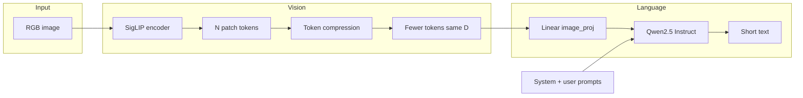

# COMP4901D: Visual Navigation VQA — Project overview (Vision & benchmarks)

This document explains **what the repository does**, how pieces connect, and how teammates (voice, Jetson, full VLM) should plug in. For **Jetson-specific setup and pitfalls**, see [`AGENTS.md`](AGENTS.md).

---

## 1. Project goal

Build a **low-latency** pipeline that turns a **single camera frame** into **short spoken-style guidance** for visually impaired navigation: crosswalk signal hints (`red` / `green` / uncertain), stairs/steps, and obstacles. The team trades off **speed** (fewer visual tokens, smaller LLM, quantization) vs **quality** (measured on a small curated eval set in `data/eval/`).

This repo currently implements a **research baseline**: **SigLIP** vision tokens → **optional compression** → **linear projection** into the text embedding space of **Qwen2.5-0.5B-Instruct**, then text generation. It is **not** a production-grade joint VLM; it exists to benchmark **token compression** and prompts before or alongside a fuller model.

---

## 2. Architecture (data flow)



1. **SigLIP** (`src/vision/siglip_encoder.py`) outputs patch features `(B, N, D)` where `N` is **576** (`24×24`) or **729** (`27×27`) depending on checkpoint/processor.
2. **Compression** (`src/vision/token_compression.py`) pools spatially to a target count (e.g. `192`, `81`) via adaptive average pooling on the patch grid.
3. **VLM bridge** (`src/vlm/model.py`): `Linear(N_vis_dim → embed_dim)` then **concatenate** image embeddings **in front of** the chat prompt embeddings; `generate()` runs the causal LM on that prefix.
4. **Prompts** (`src/prompts/system_prompt.txt` + task strings in scripts) push **short**, **keyword-first** answers for eval parsing.

---

## 3. Repository layout (what lives where)

| Path | Role |
|------|------|
| `src/vision/` | SigLIP wrapper, token compression, presets (`recommended_targets`). |
| `src/vlm/` | `SimplePrefixVLM`, LLM loaders (FP16 vs AWQ). |
| `src/prompts/` | System prompt text + loader. |
| `data/eval/` | `labels.json` schema + `images/` (crosswalk, stairs, obstacles). |
| `scripts/run_once.py` | Single-image CLI for quick tests. |
| `scripts/benchmark_compression.py` | Full sweep: timing, accuracies, `by_task` breakdown, JSON report. |
| `scripts/jetson_run_benchmark.sh` | Jetson helper: deps + FP16 sweep (+ AWQ if folder exists). |
| `scripts/jetson_quantize_llm_awq.sh` | Optional on-device AWQ for the LLM. |
| `scripts/quantize_llm_awq.py` | Creates quantized LLM directory for `--llm_mode awq`. |
| `reports/` | Benchmark outputs (e.g. `fp16_benchmark.json`). |

---

## 4. Evaluation and metrics (for reports and graphs)

- **`accuracy_gt_known`**: Every item whose label is not `unknown`; prediction must match ground truth. **`unknown` from the model counts as wrong.** Same `n` across compression levels → **fair comparison**.
- **`accuracy_scored`**: Only items where **both** ground truth and prediction are non-`unknown`; useful when studying “when the model commits to an answer.”
- **`by_task`**: Both metrics **per** `crosswalk_signal`, `stairs`, and `obstacles`. **Always check this** before trusting a single blended number.
- **`timing_s`**: `encode`, `compress`, `llm`, `total` (mean / p50 / p95). Bottleneck is usually **LLM decode**, not pooling.
- **`gen_new_tokens`**: How many token IDs were decoded (rough proxy for rambling vs short answers).

Benchmark JSON also records `benchmark_config` (e.g. `max_new_tokens_eval` used on Jetson).

---

## 5. Task-split compression (deployment policy)

Empirically on our eval set, **crosswalk** needs **more** visual tokens than coarse obstacle/stair cues.

| Task | Suggested first try | Note |
|------|---------------------|------|
| `crosswalk_signal` | **576** (full grid) or **192** | 81/36 often hurts red/green. |
| `stairs`, `obstacles` | **81** or **36** after checking `by_task` | May suffice for large structures. |

Implement by choosing `target_tokens` **from task** before `compress_27x27_tokens`.

---

## 6. Working with Hashim (full VLM) — parallel vs wait

**Recommendation: work in parallel, not serial.**

- **Ibrahim / this repo** can keep improving **eval hygiene**, **prompts**, **compression schedules**, **Jetson packaging**, and **integration contracts** without blocking Hashim.
- **Hashim** can replace or wrap **`SimplePrefixVLM`** (and optionally swap SigLIP for a joint encoder) **as long as** the outer interface stays predictable for the rest of the team.

**Suggested integration contract for Hashim’s VLM**

- **Inputs**: RGB image (path or tensor), `task` enum, optional `max_new_tokens`, optional `compression` or “use native vision encoder” flag.
- **Output**: Plain string (short navigation line); optionally extend to structured JSON (see below).
- **If Hashim’s model already ingests images natively**, compression may become internal or unused; keep a **feature flag** so benchmarks can still run “prefix + Qwen” for ablations.

Document any API change in this outline and in [`AGENTS.md`](AGENTS.md).

---

## 7. Integration contract (voice / agent teammate)

### CLI today

- Script: `scripts/run_once.py`
- Typical: `--image-path`, `--task`, `--compression`, `--llm-mode`, `--max_new_tokens`

### Normalized verdicts

- Crosswalk: `red` | `green` | `unknown`
- Stairs / obstacles: `yes` | `no`

Voice layer should treat **`unknown`** as **cautious** (“unclear—stop and recheck”), not as permission to cross.

### Suggested wrapper JSON

```json
{
  "timestamp": "ISO-8601",
  "task": "crosswalk_signal|stairs|obstacles",
  "compression": 192,
  "verdict": "red|green|unknown|yes|no",
  "instruction": "short action for TTS",
  "raw_text": "model output",
  "image_path": "string"
}
```

---

## 8. Implemented components (checklist)

- Token compression for **576** and **729** patch grids with shared presets.
- SigLIP vision wrapper; Python **3.8-safe** typing in `src/` where required.
- Minimal prefix VLM + AWQ path for **LLM only** (vision stays FP16 in current flow).
- Eval labels + benchmark script with **`by_task`** and generation caps for stable Jetson timings.
- Jetson shell helpers and `requirements-jetson.txt` (does **not** install `torch`; use NVIDIA/Jetson wheels).
- **AWQ loader fixed** (see section 11 below): `load_llm_awq` now correctly falls back to the original unquantized FP16 model on aarch64 instead of misinterpreting 4-bit packed weights as FP16.
- **Python 2/3 fix**: `benchmark_compression.py` now has `from __future__ import annotations` so dataclass field annotations work on Python 3.8 (Jetson default).

---

## 9. Running (summary)

- **Local / dev**: Python 3.8+ in venv; install `requirements.txt` + correct **torch** for your machine.
- **Jetson**: See [`AGENTS.md`](AGENTS.md) — venv, `PYTHONPATH`, `bash scripts/jetson_run_benchmark.sh`. The AWQ leg of `jetson_run_benchmark.sh` is **skipped** until `quantized/qwen2p5_0p5b_awq_int4` exists; use `QUANTIZE_AWQ_FIRST=1` or quantize on a PC and `scp` the folder (details in AGENTS.md).
- **Always use `python3`** on Jetson — `/usr/bin/python` is Python 2.7 on L4T.

---

## 10. Optional next improvements (Ibrahim track)

These do **not** require waiting for Hashim:

- **Larger or finer eval set** + confusion tables (crosswalk red vs green vs unknown).
- **Per-task `max_new_tokens`** or constrained decoding for classification-style outputs.
- **AWQ benchmark** vs FP16 once `quantized/` exists (memory bandwidth / latency).
- **Crop / dual-resolution** path for crosswalk (high-res ROI + low-res context).
- Small **readme** table generator script from `reports/*.json` for weekly reports.

Coordinate with Hashim before changing **tensor shapes** or **model class names** that his VLM code might import.

---

## 11. AWQ loader fix & benchmark results (completed)

### Problem

The original `load_llm_awq` in `src/vlm/llm_loader.py` stripped the `quantization_config` from the quantized model directory and loaded it via `AutoModelForCausalLM`. This caused the 4-bit packed integer weights to be interpreted as FP16 floats, producing **100% garbage output** (random multilingual tokens, code fragments) and **0% accuracy** across all compression levels.

Root cause documented in `Jetson Environment Profile.md`: standard `autoawq` GEMM kernels are **incompatible with Python 3.8 / Torch 2.0.0+nv23.05 on aarch64**.

### Fix (`src/vlm/llm_loader.py`)

`load_llm_awq` now has two paths:
- **x86_64**: tries `AutoAWQForCausalLM.from_quantized()` first; falls back to FP16 if autoawq is not installed.
- **aarch64 (Jetson)**: skips AWQ kernels entirely and loads `Qwen/Qwen2.5-0.5B-Instruct` (the original unquantized model) in FP16 on CUDA — same weights as the FP16 benchmark but on GPU.

### Fix (`scripts/benchmark_compression.py`)

- Added `from __future__ import annotations` to fix `SyntaxError` on Python 3.8 (dataclass field annotations).
- Removed broken `rotary_emb` compatibility patch that was written for the old broken load path.

### AWQ benchmark results (Jetson Orin NX, `max_new_tokens_eval=12`)

| Tokens | FP16 CPU acc | AWQ GPU acc | AWQ p50 LLM latency |
|--------|-------------|-------------|---------------------|
| 576 | 31.25% | 18.75% | 1.39s |
| 192 | 43.75% | **68.75%** | **0.82s** |
| 81 | 56.25% | 37.5% | 0.33s |
| 36 | 43.75% | 31.25% | 0.26s |
| 9 | 31.25% | 31.25% | 0.25s |

**Key findings:**
- **192 tokens is the AWQ sweet spot** — best accuracy (68.75%) with fast GPU inference (p50 0.82s vs ~3.3s on CPU FP16).
- **Accuracy limitations are architectural**, not a dataset size issue — the randomly initialized `image_proj` linear layer means the model has no trained visual grounding. Results serve as an unaligned baseline for the project report.
- **Crosswalk red bias** persists across all compression levels — the model never correctly predicts green, reflecting the text-only prior of Qwen rather than visual understanding.
- **Stairs/obstacles at 9 tokens** — 80% stairs accuracy confirms coarse compression is sufficient for large structures.
